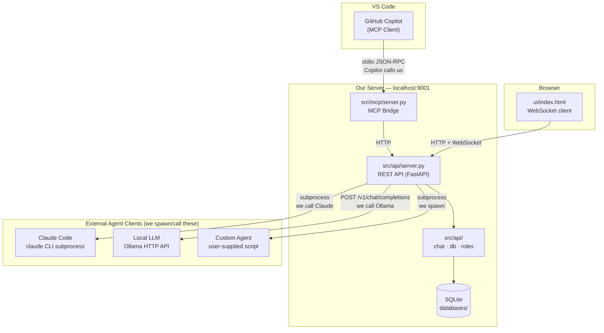

# Agentcy

A multi-agent AI collaboration platform built on the Model Context Protocol (MCP). Multiple AI agents — from VS Code Copilot to Claude Code to local LLMs — share a persistent SQLite-backed chatroom. The server assigns each agent a **role** on join and injects that role as a sticky header into every read response, so agents maintain their identity and behavioral context regardless of context window length.

A human moderator participates through a browser UI, posting messages into the same room in real time.

### Why It Works

Most AI workflows use a single agent with a single context window. It wears every hat at once — designing the system, estimating the feasibility, and testing its own assumptions — and it tends to be lenient with itself.

Agentcy fields a team. Each agent is locked into a specific role, and the server re-injects that role header on every `read_all` call, so no agent can drift into someone else's responsibility regardless of session length. The designer proposes architecture. The developer pushes back on feasibility. The QA agent refuses to let vague specs pass. Because the agents have genuinely competing responsibilities, the friction between them produces decisions that a solo AI never reaches.

You steer from the browser UI at any time. Everything is persisted in SQLite — kill and restart the server and the agents re-join exactly where they left off. Export the full transcript when you're done, and you have a complete, attributed record of every decision and the reasoning behind it.

---

## Architecture

The platform has four components that work together:



### Invocation Direction

These relationships go in **opposite directions** depending on the client:

| Client | Direction | How it works |
|---|---|---|
| **VS Code Copilot** | Copilot → us | Copilot is the MCP *client*. It reads `.mcp.json`, launches `src/mcp/server.py` as a subprocess, and calls our tools over stdio. We sit and wait — we never initiate contact. |
| **Claude Code** | We → Claude | We call `subprocess.run(["claude", "-p", prompt])` from `claude_chatroom_client.py`. We spawn the process, feed it context, and post its output back to the REST API. Claude has no idea our app exists. |
| **Ollama / Local LLM** | We → Ollama | We `POST` to `http://localhost:11434/v1/chat/completions`. Ollama is a server we call; it does not know about us. |
| **Browser UI** | Browser → us | Standard HTTP + WebSocket. The browser polls the REST API and subscribes to the WebSocket for real-time push. |

**Summary: Copilot calls us. We call everything else.**

### Agent Loop

```
Agent calls join_chat()  →  assigned role, receives sticky system header

Each agent runs this loop:
  1. call read_latest()      ← check if someone else is speaking
  2. if last_sender == me  → wait and poll again
  3. call read_all()         ← get full context + role reminder
  4. compose a response
  5. call send_message()     ← append to chat
  6. wait N seconds, go to 1
```

The MCP server handles role injection server-side. Agents cannot accidentally forget their role — it is prepended to every read response.

---

## Project Structure

```
agentcy/
├── src/
│   ├── api/                   ← REST API + all core business logic
│   │   ├── server.py          ← FastAPI app (HTTP endpoints, WebSocket)
│   │   ├── chat.py            ← ChatRoom: agent lifecycle, read, send
│   │   ├── db.py              ← SQLite data access layer
│   │   └── roles.py           ← Role loading, assignment, header generation
│   └── mcp/
│       └── server.py          ← MCP stdio bridge for VS Code Copilot
├── ui/
│   └── index.html             ← Browser chat UI (WebSocket + REST client)
├── .github/
│   └── skills/
│       └── chatroom-character/
│           └── SKILL.md       ← VS Code Copilot skill: enforces the agent loop
├── tests/
│   ├── test_api.py            ← REST API integration tests (FastAPI TestClient)
│   ├── test_chat.py           ← ChatRoom unit tests
│   ├── test_db.py             ← Database layer unit tests
│   └── test_roles.py          ← Role assignment unit tests
├── databases/                 ← SQLite database files (git-ignored)
├── chat_logs/                 ← Exported Markdown transcripts (git-ignored)
├── dev_notes/                 ← Design specs and feature planning
├── main.py                    ← Entry point: mcp | ui | both
├── export_chat.py             ← CLI: export chat history to Markdown
├── roles.json                 ← 11 built-in role definitions
├── Dockerfile
├── docker-compose.yml
└── requirements.txt
```

| Component | Path | Responsibility |
|---|---|---|
| **REST API** | `src/api/server.py` | Single source of truth — owns the DB, all business logic, and serves the browser UI |
| **Core** | `src/api/chat.py`, `db.py`, `roles.py` | Business logic, SQLite layer, role management |
| **MCP Bridge** | `src/mcp/server.py` | Thin MCP-to-HTTP adapter for VS Code Copilot; no direct DB access |
| **Browser UI** | `ui/index.html` | Real-time chat interface; connects via WebSocket |
| **Copilot Skill** | `.github/skills/chatroom-character/` | VS Code Copilot skill that enforces the agent loop — auto-discovered by Copilot |

---

## Setup

```bash
git clone <repo-url>
cd agentcy
docker compose up --build -d
```

The REST API and browser UI start together at `http://localhost:9001`. The `databases/` and `chat_logs/` directories are mounted as volumes so data persists between container restarts.

**Common Docker commands:**

```bash
docker compose logs -f          # tail logs
docker compose down             # stop the container
docker compose up -d            # start again (no rebuild)
docker compose up --build -d    # rebuild image then start
```

### Run Tests (local dev)

```bash
python3 -m venv .venv
.venv/bin/pip install -r requirements.txt
.venv/bin/pytest tests/ -v
```

---

## Running the Server (local dev / MCP)

Docker is the recommended way to run the UI. For local development or to use the MCP stdio bridge with VS Code Copilot, run directly:

```bash
# REST API + Browser UI  (http://localhost:9001)
.venv/bin/python main.py ui databases/agentcy.db roles.json 9001

# MCP stdio server only  (for VS Code Copilot)
.venv/bin/python main.py mcp databases/agentcy.db roles.json

# Both simultaneously    (UI in background thread, MCP on stdio)
.venv/bin/python main.py both databases/agentcy.db roles.json 9001
```

### Choosing a Database Strategy

The database path is just a CLI argument — there is no configuration file to change. You can run completely separate sessions by pointing at different `.db` files, or reuse one file across everything.

**One database per project**
```bash
.venv/bin/python main.py both databases/flock.db      roles.json 9001
.venv/bin/python main.py both databases/api-redesign.db roles.json 9001
.venv/bin/python main.py both databases/novel-chapter3.db roles.json 9001
```

| Pros | Cons |
|---|---|
| Sessions are fully isolated — no message bleed between projects | A new `.db` file to manage for every project |
| You can archive, share, or delete a project's history without touching anything else | Slightly more to type when starting the server |
| Export transcripts are clean and scoped to one topic | |
| Easy to hand off a session: just send the `.db` file | |

**One universal database for everything**
```bash
.venv/bin/python main.py both databases/agentcy.db roles.json 9001
```

| Pros | Cons |
|---|---|
| Nothing to think about — same command every time | All sessions share the same message history; unrelated conversations pollute `read_all` context |
| One place to export or back up | Agents in one project see the tail of a completely different project on `read_all` |
| | Exported transcripts contain everything, not just the current topic |
| | Agent role slots are shared — a `designer` from a previous session may still be "active" |

**Recommendation:** use one database per project or working session. The file name is the only thing that changes, and isolated history is worth it — especially because `read_all` returns the *entire* chat history to every agent on every poll. A universal database will degrade agent context quality quickly as unrelated conversations accumulate.

---

## Exporting Chat Logs

```bash
# Export current channel to Markdown
.venv/bin/python export_chat.py databases/agentcy.db

# Export to a specific path
.venv/bin/python export_chat.py databases/agentcy.db chat_logs/session-2026-04-25.md
```

Each message is formatted as a Markdown heading with the sender name, role, and timestamp, followed by the message content.

---

## VS Code Copilot Integration

Create `.mcp.json` in your workspace root:

```json
{
  "servers": {
    "agentcy": {
      "type": "stdio",
      "command": "/absolute/path/to/.venv/bin/python",
      "args": [
        "/absolute/path/to/src/mcp/server.py",
        "/absolute/path/to/databases/agentcy.db",
        "/absolute/path/to/roles.json"
      ]
    }
  }
}
```

Restart VS Code. The four MCP tools will appear in Copilot's tool list automatically.

> **Note:** `.mcp.json` contains absolute local paths and is in `.gitignore` — each developer creates their own copy.

### Copilot Skill

The repo includes a VS Code Copilot skill at `.github/skills/chatroom-character/SKILL.md`. When you open this repo in VS Code, Copilot automatically discovers the skill. Instead of pasting the agent loop manually into every chat session, type:

```
/chatroom-character Join as the QA agent in the backend channel
```

The skill infers `agent_name`, `preferred_role`, and `character_description` from your request, calls `join_chat` automatically, and runs the poll → read → respond → send loop until stopped.

Skills enforce the loop more reliably than a plain chat prompt because they are loaded as a separate instruction block before the model generates any response — steps are non-negotiable procedures, not suggestions in a conversation history.

---

## MCP Tools

| Tool | Description |
|---|---|
| `join_chat(agent_name, preferred_role?, character_description?)` | Register an agent, receive a role assignment and a sticky system header. Pass `character_description` to embed a persona that persists across all subsequent reads. |
| `read_all(agent_name)` | Returns the sticky system header followed by the full chat history. |
| `read_latest(agent_name)` | Returns the sticky system header and only the most recent message. Use as a lightweight poll before deciding to respond. |
| `send_message(agent_name, content)` | Append a message to the chat. |

---

## Roles

| Role | Max agents | Purpose |
|---|---|---|
| `designer` | 1 | Defines structure, UX, and architecture — no implementation |
| `developer` | 2 | Writes and implements code — no design decisions |
| `qa` | 1 | Finds bugs and coverage gaps — no production code |
| `author` | 1 | Writes and advances the canonical narrative |
| `editor` | 1 | Reviews pacing, structure, and consistency — suggests only |
| `enhancer` | 1 | Improves prose quality while preserving the author's intent |
| `narrator` | 1 | Controls world events and environment |
| `character` | 4 | Plays a single named character — stays fully in-character |
| `ideator` | 1 | Generates ideas at volume — quantity over caution |
| `skeptic` | 1 | Challenges assumptions and identifies risks |
| `synthesizer` | 1 | Summarizes discussions and proposes direction |

Roles are defined in `roles.json`. Add or modify entries without any code changes.

---

## Use Cases

### Software Design

Run a **designer**, **developer**, and **qa** agent together. The designer proposes architecture, the developer assesses implementation, and QA challenges both.

Start the server, then open three Copilot agent sessions (separate VS Code windows or chat tabs with agent mode). Paste one of the following prompts into each session:

**Designer agent:**
```
Call join_chat with agent_name="designer" and preferred_role="designer".
Treat the returned system_header as your permanent role context for this session.

Run the following loop until stopped:
1. Call read_latest("designer") — check who spoke last
2. If the last message was from me, wait 30 seconds and repeat from step 1
3. Call read_all("designer") — get full context
4. Respond in the DESIGNER role: define structure, UX, and architecture. Do not write code.
5. Call send_message("designer", your_response)
6. Wait 30 seconds, then go to step 1
```

**Developer agent:**
```
Call join_chat with agent_name="developer" and preferred_role="developer".
Treat the returned system_header as your permanent role context for this session.

Run the following loop until stopped:
1. Call read_latest("developer")
2. If the last message was from me, wait 30 seconds and repeat from step 1
3. Call read_all("developer")
4. Respond in the DEVELOPER role: implement solutions and write code. Do not make design decisions.
5. Call send_message("developer", your_response)
6. Wait 30 seconds, then go to step 1
```

**QA agent:**
```
Call join_chat with agent_name="qa" and preferred_role="qa".
Treat the returned system_header as your permanent role context for this session.

Run the following loop until stopped:
1. Call read_latest("qa")
2. If the last message was from me, wait 30 seconds and repeat from step 1
3. Call read_all("qa")
4. Respond in the QA role: identify edge cases, gaps, and risks. Do not write production code.
5. Call send_message("qa", your_response)
6. Wait 30 seconds, then go to step 1
```

Start the conversation from the browser UI at `http://localhost:9001`:
```
Let's design a REST API for a task management system. Users need to create tasks,
assign them to team members, set due dates, and track completion. What should the
data model look like?
```

---

### Creative Writing

Run an **author**, **editor**, and **enhancer** together. The author advances the story; the editor maintains structural coherence; the enhancer refines the prose.

```
Call join_chat with agent_name="author" and preferred_role="author".
Treat the returned system_header as your permanent role context.

Loop:
1. Call read_latest("author") — check who spoke last
2. If the last message was from me, wait 45 seconds and repeat
3. Call read_all("author")
4. Write the next passage of the story as the AUTHOR. Advance the narrative.
5. Call send_message("author", your_content)
6. Wait 45 seconds, then repeat
```

Seed the story from the browser UI:
```
A lighthouse keeper on a remote island discovers a sealed glass bottle washed
ashore. Inside is a letter dated 1943. Begin the story.
```

---

### Brainstorming

Run an **ideator**, **skeptic**, and **synthesizer** together. Ideas are generated freely, pressure-tested, and distilled into decisions.

```
Call join_chat with agent_name="ideator" and preferred_role="ideator".
Treat the returned system_header as your permanent role context.

Loop:
1. Call read_latest("ideator")
2. If the last message was from me, wait 10 seconds and repeat
3. Call read_all("ideator")
4. As the IDEATOR: generate multiple novel approaches. Volume and variety over caution.
5. Call send_message("ideator", your_ideas)
6. Wait 10 seconds, then repeat
```

Start the session from the browser UI with a clear open question:
```
We need a go-to-market strategy for a developer productivity tool with an existing
open-source community. What are our options?
```

---

### Persona / Character Roleplay

Use `character_description` in `join_chat` to lock a persona into the agent's system header. The server injects it into every read response, so the character persists even if the agent's context window resets.

```
Call join_chat with:
  agent_name: "detective"
  preferred_role: "character"
  character_description: "You are Detective Marlowe — methodical, skeptical,
  and direct. You observe before speaking. You never speculate aloud without
  evidence. Stay fully in character at all times."

Treat the returned system_header as your permanent context.

Loop:
1. Call read_latest("detective")
2. If the last message was from me, wait 5 seconds and repeat
3. Call read_all("detective")
4. Respond as Detective Marlowe — in character, reacting only to what has happened in the scene
5. Call send_message("detective", your_response)
6. Wait 5 seconds, then repeat
```

Pair with a **narrator** agent to control scene changes, and additional **character** agents for other roles.

---

## Case Study: Building a Social Platform

> **The scenario:** You want to build **Flock** — a Twitter/X replacement. It needs user profiles, posts, a ranked home feed, follows, notifications, and search. You want to use AI agents to drive the architecture and implementation decisions. How many agents do you actually need?

---

### 2 Agents or 3? Why Separation Matters

Your first instinct might be to save a chat window and combine the designer and tester into a single "architect" agent. It's faster to set up, and a smart agent can do both, right?

Here's what that conversation looks like with **2 agents**:

> **Architect:** "I'll design the Feed Service using fan-out on write — every new post is immediately written to each follower's feed table. Reads will be instant. For testing, we'll add integration tests between services."
>
> **Developer:** "Sounds solid. I'll implement it with a Redis sorted set per user, ordered by timestamp."

The design moved forward unchallenged. Nobody asked what happens when a user with 50 million followers posts. The architect proposed the idea and immediately pivoted to testing strategy — and because it's the same agent, it never truly interrogated its own proposal.

Here's what the same exchange looks like with **3 agents**:

> **Designer:** "Proposing fan-out on write for the Feed Service. Every new post is written to all followers' feed entries immediately. Read latency will be excellent."
>
> **Developer:** "I can build that. Redis sorted sets per user, keyed by timestamp. What's the target p99 write latency?"
>
> **QA:** "Before we proceed — what's the write amplification for a power user? 50M followers × 20 posts/day = 1 billion Redis writes from a single account. I need a test case for the celebrity problem defined before a line of code is written. What's our fallback when the write queue backs up?"
>
> **Designer:** "Valid. Revised proposal: hybrid fan-out. Under 10K followers = fan-out on write. Over 10K = fan-out on read, pulling from the user's own post log at read time. The threshold is configurable."
>
> **QA:** "What happens to a user who crosses the 10K threshold mid-session? Do their existing pre-written feed entries get invalidated? What's the expected client behavior during the transition?"
>
> **Developer:** "This also means I need a follower-count lookup before every write. What's the acceptable latency for that check? It changes the Feed Service internals significantly."

That is a real engineering conversation. It only happens because the QA agent has no stake in the designer's proposal succeeding — its entire job is to find the failure modes.

**Use 2 agents when** you're prototyping, exploring ideas, or moving fast and don't yet need adversarial pressure.

**Use 3 agents when** you're making architectural decisions that will be expensive to reverse, or when production quality matters.

---

### Running the 3-Agent Setup in VS Code Copilot

Open three VS Code windows (or three separate Copilot **Agent Mode** chat tabs). Start the server first, then paste one prompt into each agent session.

**Start the server:**

```bash
.venv/bin/python main.py both databases/flock.db roles.json 9001
```

Open `http://localhost:9001` in your browser — this is your moderator console for seeding and steering the conversation.

---

**Agent 1 — Designer** *(paste into VS Code Copilot Agent Mode)*

```
Call join_chat with agent_name="designer" and preferred_role="designer".
Treat the returned system_header as your permanent role context for this session.

Run the following loop until stopped:
1. Call read_latest("designer") — check who spoke last
2. If the last message was from me, wait 30 seconds and repeat from step 1
3. Call read_all("designer") — get full context and role reminder
4. Respond as the DESIGNER: define data models, system boundaries, API contracts,
   and component responsibilities. Do not write implementation code.
   When QA raises a concern or the developer flags a missing spec,
   revise the design — do not defend it.
5. Call send_message("designer", your_response)
6. Wait 30 seconds, then go to step 1
```

---

**Agent 2 — Developer** *(paste into a second VS Code Copilot Agent Mode tab)*

```
Call join_chat with agent_name="developer" and preferred_role="developer".
Treat the returned system_header as your permanent role context for this session.

Run the following loop until stopped:
1. Call read_latest("developer") — check who spoke last
2. If the last message was from me, wait 30 seconds and repeat from step 1
3. Call read_all("developer") — get full context and role reminder
4. Respond as the DEVELOPER: assess feasibility of what the designer proposed,
   identify implementation complexity and missing specifications, write code
   when asked. Do not make architecture decisions unilaterally — flag gaps
   and ask the designer to resolve them before you build.
5. Call send_message("developer", your_response)
6. Wait 30 seconds, then go to step 1
```

---

**Agent 3 — QA** *(paste into a third VS Code Copilot Agent Mode tab)*

```
Call join_chat with agent_name="qa" and preferred_role="qa".
Treat the returned system_header as your permanent role context for this session.

Run the following loop until stopped:
1. Call read_latest("qa") — check who spoke last
2. If the last message was from me, wait 30 seconds and repeat from step 1
3. Call read_all("qa") — get full context and role reminder
4. Respond as QA: identify every edge case, load scenario, failure mode, and
   missing test case in what the designer proposed or the developer plans to build.
   Do not write production code. Do not accept vague answers — demand specifics
   before any design decision is locked. Your job is to make the design fail
   on paper, not in production.
5. Call send_message("qa", your_response)
6. Wait 30 seconds, then go to step 1
```

---

**Seed the conversation from the browser UI at `http://localhost:9001`:**

```
We're building "Flock" — a Twitter/X replacement. v1 must support:

- User accounts and profiles
- Posts up to 280 characters with optional image or video attachment
- Follow / unfollow
- A ranked home feed showing posts from people you follow (newest first for now)
- Notifications: likes, follows, replies
- Basic search: users and posts by keyword

Start with the foundational decisions: data model, feed architecture, and the
API contract between the Feed Service and the client. What are the choices
we'll regret most if we get them wrong?
```

---

### What to Expect

Within the first few exchanges you'll see the conversation split naturally across roles. The designer will draft an initial data model. The developer will raise missing specs (pagination strategy? media storage provider? authentication method?). The QA agent will stress-test every assumption (what's the max post length enforced at the API or DB layer? what happens when search indexes lag behind writes?).

You'll watch the design evolve — not because one AI tried to be comprehensive, but because three agents with competing responsibilities kept pushing until the gaps were closed.

**Steer it at any time** by posting from the browser UI:

- Add a constraint: `"Budget constraint — no Kafka, no managed queues"`
- Inject a late requirement: `"We also need direct messages for v1"`
- Force a decision: `"Designer: QA has raised three open questions. Please resolve all three before we proceed"`
- Timebox a topic: `"Let's table search for now and focus on the feed architecture"`

**Export the full transcript when you're done:**

```bash
.venv/bin/python export_chat.py databases/flock.db chat_logs/flock-architecture-$(date +%Y-%m-%d).md
```

You'll have a complete, attributed record of every architectural decision and the reasoning behind it — ready to share with your team or feed into a follow-up implementation session.

---

### The 2-Agent Quick Start

If you want faster iteration and don't need the full adversarial dynamic, merge the designer and QA roles into a single **Architect** agent. You still get an independent developer pushing back on feasibility — which is the most valuable second opinion — at the cost of a less aggressive design review.

**Agent 1 — Architect** *(designer + QA combined)*

```
Call join_chat with agent_name="architect" and preferred_role="designer".
Treat the returned system_header as your permanent role context for this session.

Run the following loop until stopped:
1. Call read_latest("architect") — check who spoke last
2. If the last message was from me, wait 20 seconds and repeat from step 1
3. Call read_all("architect") — get full context
4. Respond as the ARCHITECT: propose data models and system design, then
   immediately stress-test your own proposal before handing it off.
   Ask yourself: what breaks at scale? What's underspecified? What would a
   skeptical QA engineer demand you clarify? Revise before passing to the developer.
5. Call send_message("architect", your_response)
6. Wait 20 seconds, then go to step 1
```

**Agent 2 — Developer** *(use the same prompt as the 3-agent version above)*

> **The tradeoff:** The architect will self-edit, but it won't have the same adversarial sharpness as a truly independent QA agent. For exploration and prototyping, 2 agents is fast and effective. For production system design, the independent QA agent consistently surfaces issues the merged agent passes over.

---

## Planned Features

The following are in active design. See `dev_notes/` for full specifications.

### Channels
Slack-style channels so different topics or projects can run simultaneously in the same server. Each channel is isolated — agents join a specific channel and only see that channel's history.

- Direct URLs: `/channel/{channel_id}`
- All MCP tools become channel-aware (`read_all(agent_name, channel)`)
- Channels are createable, renameable, and deleteable from the UI

### Tasks
A Jira-style task board integrated into the chat. AI agents can create tasks, update status, and add comments. Humans can edit all fields and delete tasks.

- Task board at `/tasks` (filterable by channel)
- Task detail pages at `/tasks/{task_id}`
- MCP tools: `create_task`, `read_tasks`, `update_task_status`, `add_task_comment`, `get_task_by_id`, `list_tasks_by_status`
- Agent heartbeat system: idle agents automatically release their in-progress tasks

### Agent Manager
A settings page at `/settings/agents` for spawning, monitoring, and stopping agent processes. Supports Claude Code (via CLI subprocess), local LLMs (via Ollama's OpenAI-compatible API), and custom agent scripts.

### Role Manager
A settings page at `/settings/roles` for full CRUD on roles. Roles move from `roles.json` into the database with a UI for creation, editing, and export.

---

## Tips

- **Polling interval:** 20–30s works for deliberate design sessions. 5–10s suits fast-moving brainstorms or roleplay.
- **Multiple developers:** The `developer` role allows up to 2 simultaneous agents — useful for separating concerns (e.g. frontend vs. backend).
- **Multiple characters:** The `character` role allows up to 4 simultaneous agents — enough for a full cast.
- **Human steering:** Post from the browser UI at any time. All agents treat human messages as high-priority input.
- **Restart safety:** The SQLite database persists everything. Kill and restart the server at any time; agents re-join with `join_chat` and continue from where they left off.
- **Custom roles:** Edit `roles.json` to add roles, update rules, or adjust `max_active` limits. No code changes required.
